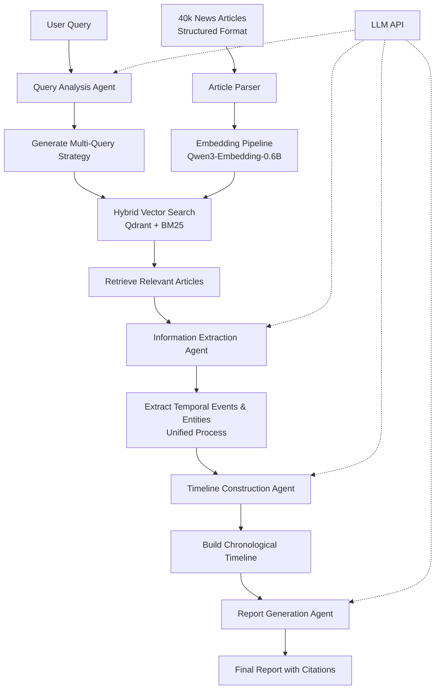

# Agentic News RAG Workflow



## Detailed Flow

1. **User Input**: Query about specific events, trends, or topics
2. **Query Analysis**: Understand intent and generate search strategy
3. **Hybrid Search**: Combine semantic (dense) and keyword (sparse) search
4. **Article Retrieval**: Find most relevant articles using RRF fusion
5. **Unified Extraction**: Extract temporal events and entities together
6. **Timeline Building**: Construct chronological narrative
7. **Answer Synthesis**: Generate comprehensive response with citations

## Agent Responsibilities

### Query Analysis Agent ✅ IMPLEMENTED
- **Query Classification**: Categorize into FACTUAL, CONCEPTUAL, TEMPORAL, ENTITY, COMPARATIVE
- **Entity Extraction**: Extract people, companies, organizations, locations using LLM
- **Temporal Parsing**: Handle relative dates ("yesterday", "last week") and explicit dates
- **Query Expansion**: Generate 3-4 alternative search queries using LLM
- **Search Optimization**: Determine alpha weight (dense vs sparse) based on query type
- **Current Status**: Implemented with Qwen3-30B integration, optimizing prompts

### Information Extraction Agent ⏳ PENDING
- Parse article content using structured format (Title/Subtitle/Authors/Published/Content)
- **Unified extraction of**:
  - Temporal information (dates, time references)
  - Events (what happened)
  - Entities (who, where, organizations)
  - Relationships between events and entities
- Handle relative date references
- Extract causal relationships
- **Implementation Plan**: Single agent for both temporal and entity extraction

### Timeline Construction Agent ⏳ PENDING
- Order events chronologically
- Resolve temporal ambiguities
- Merge duplicate events from multiple sources
- Build event chains with entity relationships
- Score confidence of temporal ordering

### Report Generation Agent ⏳ PENDING
- Synthesize timeline into coherent narrative
- Include relevant quotes and details
- Add proper citations with article metadata
- Handle conflicting information transparently

## Key Implementation Details

### Article Format
```
Title: [Article Title]
Subtitle: [Article Subtitle]  
Authors: [Comma-separated list]
Published: [ISO 8601 timestamp]

[Article body...]
```

### Search Architecture
- **Dense Search**: Qwen3-Embedding-0.6B via sentence-transformers
- **Sparse Search**: TF-IDF with BM25 scoring
- **Fusion**: Reciprocal Rank Fusion (RRF) with configurable alpha
- **Storage**: Qdrant vector database with hybrid index support
- **Status**: Design complete, implementation pending

## Implementation Files

### Completed
- `src/config.py` - Configuration management with YAML and env overrides
- `config/search_config.yaml` - Complete system configuration
- `src/agents/query_analysis.py` - Full query analysis implementation
- `scripts/test_query_analysis.py` - Comprehensive test suite
- `requirements.txt` - All Python dependencies

### Ready for Implementation
- `src/embeddings/article_parser.py` - Article parsing logic designed
- `src/embeddings/qwen_embedder.py` - Embedding pipeline ready
- `src/search/qdrant_search.py` - Hybrid search implementation planned
- `HYBRID_SEARCH_DESIGN.md` - Complete technical specification

### Current Development Environment
- **LLM Server**: Qwen3-30B at localhost:8001 with thinking enabled, 128k context
  - Model path: `D:\AI\GGUFs\Qwen3-30B-A3B-UD-Q4_K_XL.gguf`
  - Requires `n=1` parameter and max_tokens=10000 for proper output
  - Query Analysis Agent: FULLY FUNCTIONAL with 100% test accuracy
- **Articles**: 7 sample articles in `text_articles/` directory
- **Status**: Query Analysis complete and tested, ready for next phase
- **Next**: Article parser and embedding pipeline implementation